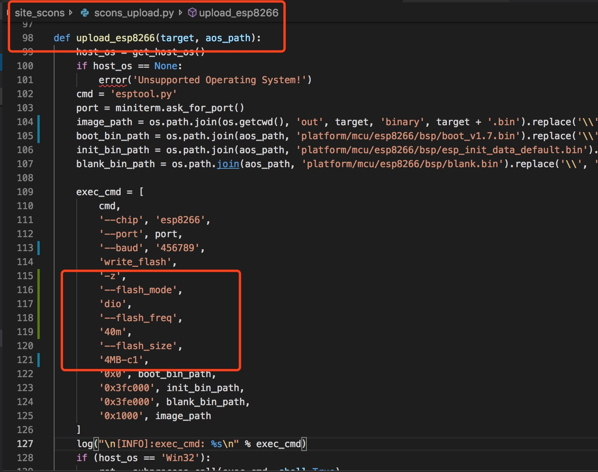
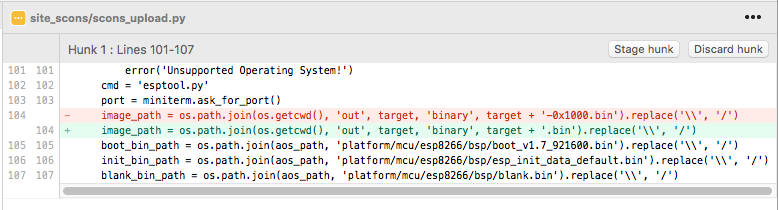

# alios-things-esp8266笔记

#### 项目介绍
alios-things-esp8266浅显笔记,自己玩的.

#### 目录

1. [linkkitapp示例](example/linkkitapp/)
2. [ESP8266 GPIO控制](hal/gpio/)
3. ...

#### 安装教程
不多说了,参考下面随便一个...
1. [钉钉群里自称业余玩家的玩机教程](https://gitee.com/walker2048/LearningAOS)
2. [github上AliOS-Things的官方wiki文档](https://github.com/alibaba/AliOS-Things/wiki)
3. [某搜索引擎](https://www.baidu.com)

#### 注意与说明

1. 据说上面方法安装的AliOS-Studio**不支持esp8266在win下的编译**,请尝试win10子系统,或docker进行编译.
2. 关于配网,据说linkkitapp示例需要在设备上电或重启的极短时间内调用`active_awss()`函数,并完成手机扫描二维码完成配网连接[二维码来源](resource/doc/Linkkit公版app使用指南.pdf).
    **推荐流畅的完成以下步骤进行配网:**
    * 烧写完成重启设备.
    * 串口输入cli命令 active_awss调起配网.
    * 手机扫描二维码进行配网.
3. esp8266 烧写参数在文件`$AliOS-Things/site_scons/scons_upload.py`中, 有些8266板子需要调整dio falsh_size什么的可以修改此处,如下图:

4. 上传文件路径错误的修改`$AliOS-Things/site_scons/scons_upload.py`

#### 为啥写这个(一些废话)

其实我是个嗷嗷懒的人, 不行就瞎试,行了扔哪玩完就忘...

这个demo我自己烧了好多次... 每次拉完新代码我自己都不知道该做什么... 又一步一步试.

还记得第一次的时候,挺无助的, 好希望有个注意事项,或者方法来参考下.本来就什么都不懂,瞎琢磨琢磨的费劲儿

还记得后来自己配网成功的喜悦,(虽然没啥值得庆祝的...)

还记得后来钉钉群里朋友配网完成他们的喜悦...

那就抽空把注意事项贴出来吧... 如果有遗漏小伙伴可以提醒我,还有我不懂的地儿伙伴知道的话记得告诉我一声儿.

#### 
