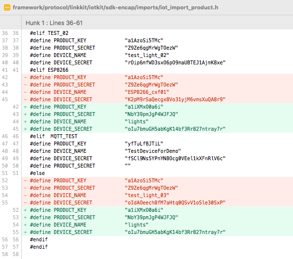
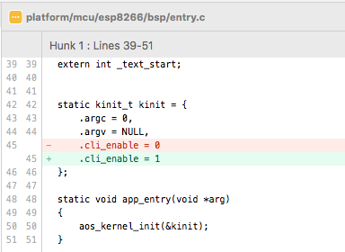
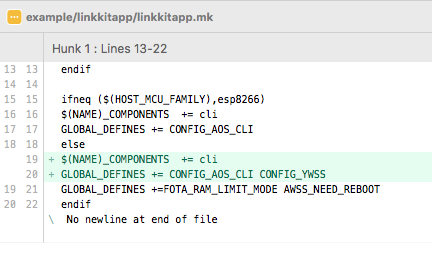
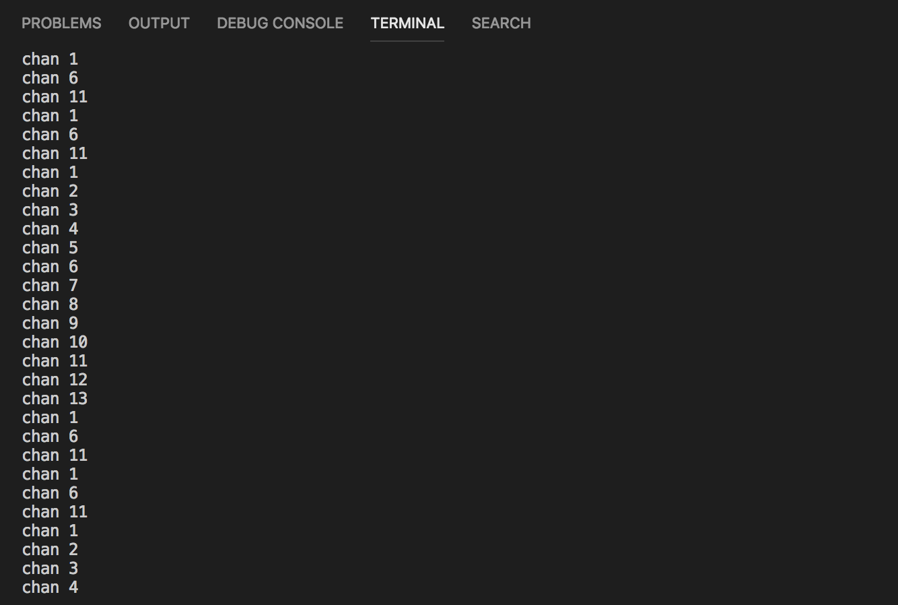
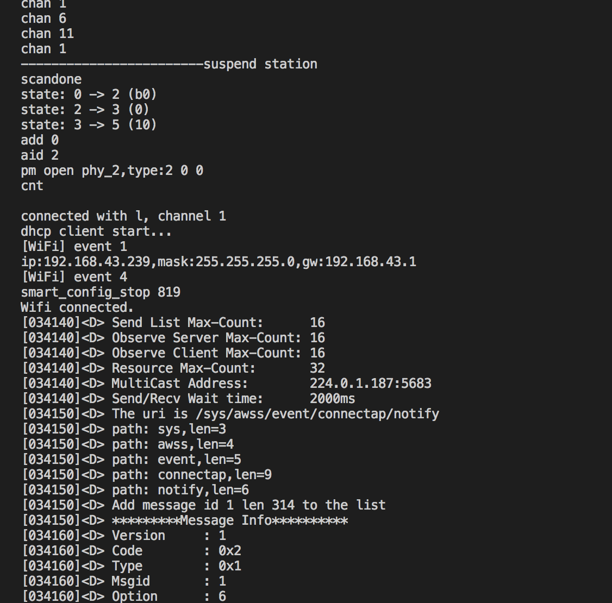

#### 配网
1. 修改三元组为你在阿里平台申请的设备相关信息.
   我是从[https://living.aliyun.com/](https://living.aliyun.com/)登录的.
   `$AliOS-Things/framework/protocol/linkkit/iotkit/sdk-encap/imports/iot_import_product.h`
   ```
    #为啥要改else下面的才好使呢?是因为ESP8266没有定义么?

    #define PRODUCT_KEY             "pk"
    #define PRODUCT_SECRET          "ps"
    #define DEVICE_NAME             "dn"
    #define DEVICE_SECRET           "ds"
    ```
  

2. 开启8266的cli命令模式
  `$AliOS-Things/platform/mcu/esp8266/bsp/entry.c`
  

3. 开启linkkitapp示例的cli命令注册
  `$AliOS-Things/example/linkkitapp/linkkitapp.mk`
  

- 烧写完成重启设备.
- 串口输入cli命令 active_awss调起配网.
- 手机扫描[二维码](resource/doc/Linkkit公版app使用指南.pdf)进行配网.

  **[所有修改代码](patch.diff) 自己对比git** 结果如下:





